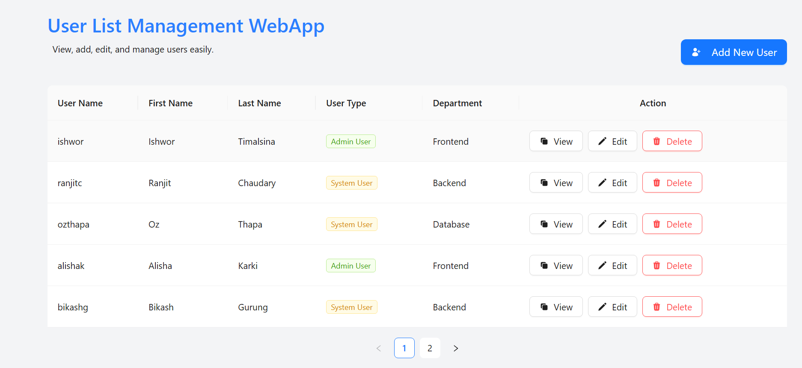
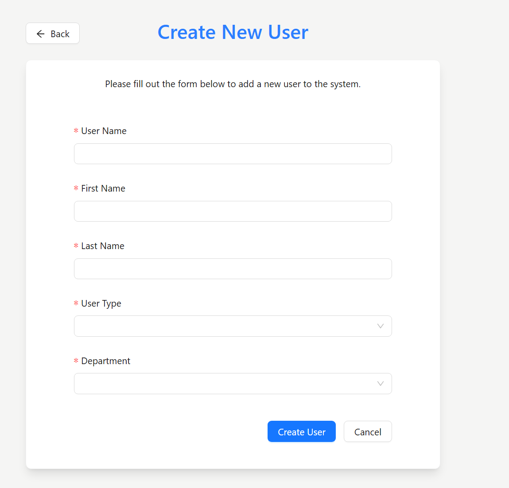
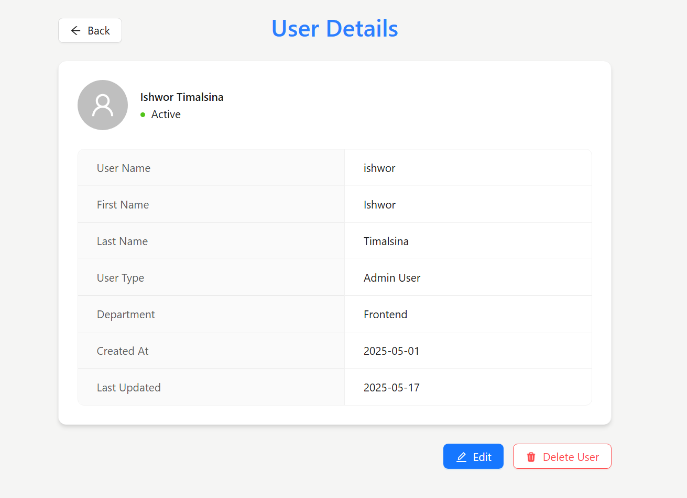
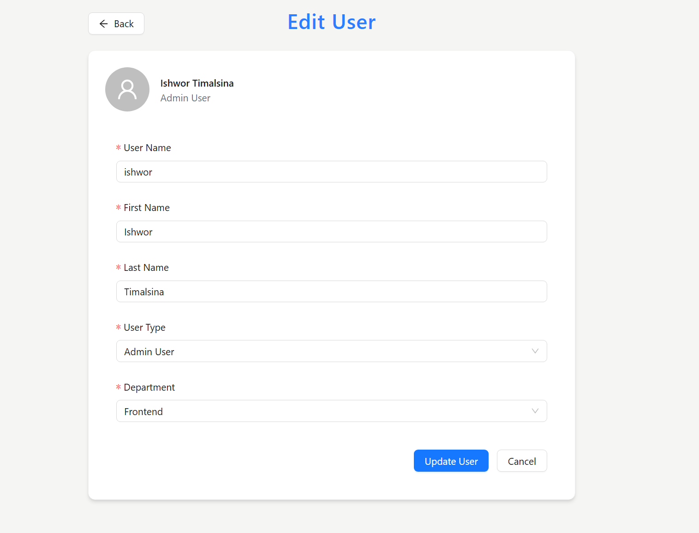
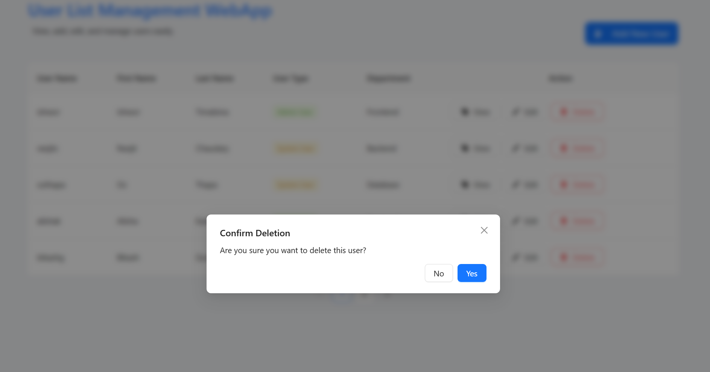

# User List Management App 🧑‍💼

A React-based user management system built using **Ant Design** for UI components and styled with **Tailwind CSS**. Developed as part of the **Front-End Developer Assessment** by Leo Club of Kathmandu Marigold under the CareerBridge Internship/Mentorship Campaign.

## 🔗 Live Demo

[Click here to view the live app](https://user-list-management-app.vercel.app/)

---

## ✨ Features

- 📋 Display a list of all users in a responsive table
- 🟢 Color-coded user types (Admin User / System User)
- 🔍 View user details in a read-only form
- ✏️ Edit and update user details
- ➕ Create new users with validation
- ❌ Delete existing users with confirmation popups
- 🚦 Route-based navigation for Create / View / Edit pages
- ✅ Form validation for required fields

---

## 🛠️ Tech Stack

- **Frontend Framework:** React
- **Component Library:** Ant Design
- **Styling:** Tailwind CSS or Bootstrap (choose one)
- **Routing:** React Router DOM

---

## 🧑‍💻 User Schema

Each user profile includes:

| Field        | Type   | Description                         |
| ------------ | ------ | ----------------------------------- |
| `id`         | Number | Auto-generated unique ID            |
| `firstName`  | String | User's first name                   |
| `lastName`   | String | User's last name                    |
| `userName`   | String | Unique user name                    |
| `userType`   | Enum   | Admin User / System User            |
| `department` | Enum   | Frontend / Backend / QA / Marketing |

---

## 📂 Pages & Routes

| Route            | Description                      |
| ---------------- | -------------------------------- |
| `/`              | User list with table and actions |
| `/user/create`   | Form to create a new user        |
| `/user/view/:id` | Read-only user details           |
| `/user/edit/:id` | Editable user details and update |

---

## 📸 Screenshots

  
  
  
  


---

## 🚀 Getting Started

### Prerequisites

- Node.js >= 18 (preferably latest LTS)
- npm or yarn

### Installation

```bash
git clone https://github.com/it-is-it/user-list-management-app.git
cd user-list-management-app
npm install
npm start
```

---

## 📁 Project Structure (Sample)

```
user-list-management-app/
├── public/
│   ├── screenshots/
│   └── index.html
├── src/
│   ├── components/
│   ├── context/
│   ├── data/
│   ├── pages/
│   ├── App.js
│   └── index.js
├── tailwind.config.js / bootstrap.css
├── package.json
└── README.md
```

---

## 📬 Submission Details

- 🔗 [GitHub Repository](https://github.com/it-is-it/user-list-management-app)
- 📄 Submitted to: Leo Club of Kathmandu Marigold
- 🧠 Focus: Code structure, problem-solving, form validation, UI design

---

## 📃 License

This project is for educational and assessment purposes only.

---

### 👨‍💻 Developed by: Ishwor Timalsina
